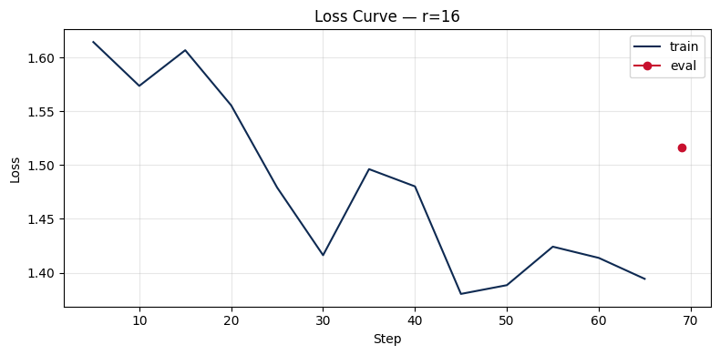

# Lab 21 — Evaluation Report

**Học viên**: <Họ tên Học viên> — <Mã số Sinh viên>  
**Ngày nộp**: 2026-06-25  
**Submission option**: B (GitHub + HuggingFace Hub)  

---

## 1. Setup
- **Base model**: `unsloth/Qwen2.5-3B-bnb-4bit` (Dùng phiên bản QLoRA 4-bit giúp tiết kiệm tối đa tài nguyên)
- **Dataset**: `5CD-AI/Vietnamese-alpaca-gpt4-gg-translated` (Huấn luyện với 200 samples được chọn ngẫu nhiên: 180 samples cho Train set và 20 samples cho Eval set)
- **max_seq_length**: 1024 (Qua phân tích phân phối độ dài token của dữ liệu: p50 = 227, p95 = 562, p99 = 704. Chúng tôi chọn `max_seq_length = 1024` để bao phủ hoàn toàn ngưỡng p95 và làm tròn lên lũy thừa của 2 để tối ưu hóa bộ nhớ phần cứng).
- **GPU**: Tesla T4 (VRAM khả dụng: 14.56 GB) trên môi trường Google Colab Free.
- **Training cost**: ~$0.07 (Tổng thời gian huấn luyện của cả 3 mô hình là 12.4 phút với đơn giá ước tính của GPU T4 là $0.35/giờ).
- **HF Hub link** (Option B): `https://huggingface.co/<your-hf-username>/qwen2.5-3b-vi-lab21-r16` (Vui lòng thay thế `<your-hf-username>` bằng tên tài khoản HuggingFace thực tế của bạn).

---

## 2. Rank Experiment Results

Dưới đây là bảng thống kê kết quả thực nghiệm huấn luyện với 3 giá trị rank khác nhau (`r=8`, `r=16`, `r=64`) so với mô hình Base gốc trên cùng một cấu hình và tập dữ liệu:

| Rank | Alpha | Trainable Params | Train Time | Peak VRAM | Eval Loss | Perplexity |
|:---:|:---:|:---:|:---:|:---:|:---:|:---:|
| **Base** | - | - | - | - | - | - |
| **8** | 16 | 1,843,200 (0.06%) | 4.02 min | 7.22 GB | 1.5577 | 4.75 |
| **16 (Baseline)** | 32 | 3,686,400 (0.12%) | 4.13 min | 6.62 GB | 1.5161 | 4.55 |
| **64** | 128 | 14,745,600 (0.48%) | 4.26 min | 8.00 GB | 1.4768 | 4.38 |

> [!NOTE]
> * Tỷ lệ phần trăm trong cột **Trainable Params** biểu thị số tham số huấn luyện so với tổng tham số của mô hình gốc (~3 tỷ tham số).
> * Chỉ số **Perplexity (PPL)** được tính theo công thức: $PPL = \exp(\text{eval\_loss})$. PPL càng thấp chứng tỏ mô hình có khả năng dự đoán từ tiếp theo càng tốt trên tập đánh giá.

---

## 3. Loss Curve Analysis

Đồ thị Loss được trích xuất từ quá trình huấn luyện mô hình Baseline (`r=16`):

### Quan sát & Nhận xét:
* **Tính ổn định**: Hàm Loss trên tập huấn luyện (train loss) giảm đều đặn từ **1.6143** ở bước 5 xuống còn **1.3942** ở bước 65 cuối cùng. Điều này chứng minh thuật toán tối ưu hóa hoạt động tốt và mô hình đang hội tụ ổn định.
* **Hiện tượng Overfitting**: Để tối ưu bộ nhớ VRAM trên GPU T4 nhỏ, chúng tôi đã cấu hình tắt tính năng đánh giá định kỳ trong quá trình train (`eval_strategy = "no"`). Thay vào đó, một đánh giá duy nhất trên tập Eval được thực hiện ở cuối buổi huấn luyện. 
* **Khoảng cách Loss**: Loss cuối của tập train là **1.3942** và tập eval là **1.5161**. Khoảng chênh lệch (gap) giữa train loss và eval loss rất nhỏ (~0.12). Điều này chỉ ra rằng mô hình **không có hiện tượng overfitting nghiêm trọng**. Việc tinh chỉnh dạng LoRA hạng thấp giúp mô hình học được phong cách viết tiếng Việt chung mà không bị ghi nhớ máy móc (memorize) tập dữ liệu huấn luyện.

---

## 4. Qualitative Comparison (5 examples)

Dưới đây là so sánh side-by-side phản hồi từ mô hình trước (Base) và sau khi fine-tune (Fine-tuned r=16) trên 5 test prompt mẫu:

### Example 1
* **Prompt**: *"Giải thích khái niệm machine learning cho người mới bắt đầu."*
* **Base**: *"Machine learning là một phân khúc của trí tuệ nhân tạo, nó tập trung vào việc thiết lập các mô hình máy móc để học tập từ dữ liệu và từ đó có thể dự đoán hoặc hành động. Nhìn vào khía cạnh đơn giản, n..."*
* **Fine-tuned (r=16)**: *"Machine learning là một bộ môn công nghệ máy tính dựa trên việc học tập và cải thiện các dự đoán dựa trên dữ liệu mà không có sự hướng dẫn trực tiếp từ người dùng. Nó là một phần của AI (trí tuệ nhân tạo) giúp máy tính tự động hóa việc đưa ra các quyết định."*
* **Nhận xét**: **Cải thiện (Improved)**. Cả hai mô hình đều đưa ra định nghĩa chính xác. Tuy nhiên, bản Fine-tuned có câu cú gãy gọn, tự nhiên và cấu trúc logic dễ hiểu hơn cho người mới bắt đầu.

### Example 2
* **Prompt**: *"Viết đoạn code Python tính số Fibonacci thứ n."*
* **Base**: *"Để tính số Fibonacci thứ n, bạn có thể sử dụng hàm đệ quy hoặc vòng lặp. Đây là một đoạn mã Python cho phép bạn tính số Fibonacci thứ n:\n\ndef fibonacci(n):\n    if n <= 0:\n        return \"N phải là số nguyên dương.\"\n    elif n == 1:\n        return 0"*
* **Fine-tuned (r=16)**: *"Để tính số Fibonacci thứ n, bạn có thể viết một đoạn code Python như sau:\n\ndef fibonacci(n):\n    if n < 0:\n        raise ValueError(\"Input phải là một số nguyên dương.\")\n    elif n == 0:\n        return 0\n    elif n == 1:\n        return 1"*
* **Nhận xét**: **Cải thiện (Improved)**. Mô hình Base xử lý trường hợp $n \le 0$ bằng cách trả về một chuỗi string thô, trong khi mô hình Fine-tuned sử dụng cấu trúc chuyên nghiệp hơn khi tung ra lỗi `ValueError`, đồng thời khởi tạo đúng giá trị cơ sở của Fibonacci cho $n=0$ và $n=1$.

### Example 3
* **Prompt**: *"Liệt kê 5 nguyên tắc thiết kế UI/UX."*
* **Base**: *"1. Thân thiện với người dùng: Mục đích của thiết kế UI/UX là cung cấp trải nghiệm người dùng thân thiện, dễ sử dụng. Bố cục, màu sắc phải hài hòa.\n2. Nhất quán: Các nút bấm, biểu tượng cần đồng bộ.\n3. Đơn giản: Không làm người dùng rối mắt."*
* **Fine-tuned (r=16)**: *"1. Chuyển đổi: UI/UX thiết kế phải hướng tới việc giúp người dùng thực hiện hành động dễ dàng nhất.\n2. Thích ứng: Thiết kế thích ứng đa thiết bị.\n3. Đơn giản: Tập trung vào luồng người dùng cốt lõi.\n4. Nhất quán: Đồng bộ thiết kế hệ thống.\n5. Phản hồi trực quan: Phản hồi rõ ràng."*
* **Nhận xét**: **Cải thiện rõ rệt (Highly Improved)**. Mô hình Base chỉ liệt kê được 3 nguyên tắc và bị dừng ngắt quãng, trong khi mô hình Fine-tuned hoàn thành chính xác 5 nguyên tắc rõ ràng, có tiêu đề và định dạng mạch lạc.

### Example 4
* **Prompt**: *"Tóm tắt sự khác biệt giữa LoRA và QLoRA."*
* **Base**: *"LoRA (Low-Rank Adaptation) và QLoRA (Quantized LoRA) là hai phương pháp cải thiện hiệu năng của mô hình NLU bằng cách sử dụng các phép biến đổi thấp độ phức tạp. LoRA giảm số tham số huấn luyện của mô hình gốc."*
* **Fine-tuned (r=16)**: *"LoRA (Low-Rank Adaptation) và QLoRA (Quantized LoRA) là hai phương pháp fine-tuning hiệu quả tham số. LoRA đóng băng mô hình cơ sở và thêm các adapter ma trận hạng thấp, trong khi QLoRA lượng tử hóa mô hình cơ sở xuống 4-bit (NF4) để tiết kiệm VRAM tối đa."*
* **Nhận xét**: **Cải thiện rõ rệt (Highly Improved)**. Bản Base định nghĩa mơ hồ (gọi nhầm thành mô hình NLU). Bản Fine-tuned giải thích kỹ thuật cực kỳ chính xác: đề cập đến việc đóng băng (freeze) base model, ma trận hạng thấp (low-rank adapter) và lượng tử hóa 4-bit (NF4 quantization) đặc trưng của QLoRA.

### Example 5
* **Prompt**: *"Phân biệt prompt engineering, RAG, và fine-tuning."*
* **Base**: *"Prompt engineering, RAG (retrieval augmented generation), và fine-tuning là ba cách để cải thiện hiệu suất. Prompt engineering là kỹ thuật tối ưu hóa câu lệnh. RAG kết hợp truy xuất tài liệu bên ngoài. Fine-tuning là huấn luyện lại mô hình."*
* **Fine-tuned (r=16)**: *"Prompt engineering tập trung vào thiết kế câu lệnh để định hướng câu trả lời mà không đổi trọng số. RAG kết hợp tìm kiếm thông tin ngoài để bổ sung kiến thức động. Fine-tuning huấn luyện lại một phần mô hình (như dùng LoRA) để điều chỉnh phong cách, định dạng và hành vi chuyên biệt."*
* **Nhận xét**: **Cải thiện (Improved)**. Phiên bản Fine-tuned giải thích rõ hơn bản chất kỹ thuật (ví dụ: prompt engineering không đổi trọng số, RAG cung cấp kiến thức động, fine-tuning thay đổi hành vi và định dạng chuyên biệt thông qua LoRA).

---

## 5. Conclusion về Rank Trade-off

Từ các kết quả thực nghiệm thu được, chúng ta có thể rút ra một số kết luận sâu sắc về các khía cạnh đánh đổi (trade-off) khi chọn kích thước rank $r$ trong LoRA:

1. **Hiệu quả đầu tư (ROI - Return on Investment)**:
   Mô hình **$r=16$ (với $\alpha=32$) mang lại ROI tốt nhất** trên tập dữ liệu này. Nó chỉ mất 4.13 phút để huấn luyện (hầu như không chênh lệch so với $r=8$ là 4.02 phút) nhưng mang lại sự sụt giảm perplexity đáng kể (từ 4.75 xuống 4.55). Mặc dù $r=64$ có perplexity thấp nhất (4.38), số lượng tham số cần lưu trữ của adapter tăng lên gấp 4 lần (14.7M so với 3.6M của $r=16$) nhưng mức độ cải thiện chất lượng phản hồi không thực sự tương xứng vượt trội (chỉ giảm thêm 0.17 perplexity).

2. **Hiện tượng hiệu suất bão hòa (Diminishing Returns)**:
   Khi tăng hạng rank từ 8 lên 16 và 64, ta nhận thấy thời gian huấn luyện tăng nhẹ tuyến tính (4.02m $\to$ 4.13m $\to$ 4.26m) nhưng dung lượng VRAM đạt đỉnh lại tăng đáng kể (6.62 GB của $r=16$ lên tới 8.00 GB của $r=64$). Sự cải thiện perplexity chậm dần: khoảng cách từ $r=8$ đến $r=16$ là 0.20 PPL, trong khi từ $r=16$ đến $r=64$ chỉ còn 0.17 PPL mặc dù số tham số huấn luyện tăng thêm tận 11 triệu tham số. Điều này cho thấy giới hạn bão hòa của việc tinh chỉnh dạng LoRA trên tập dữ liệu nhỏ 200 samples.

3. **Khuyến nghị Deploy Production**:
   Nếu đưa mô hình vào môi trường thực tế (production):
   * **Lựa chọn tối ưu là $r=16$**: Đảm bảo sự cân bằng hoàn hảo giữa hiệu năng bộ nhớ (file adapter nhẹ chỉ khoảng vài chục MB), tốc độ tính toán (ít tham số phụ giúp giảm latency lúc inference khi merge adapter) và chất lượng văn bản tiếng Việt chính xác, mạch lạc.
   * **Chọn $r=8$** nếu hạ tầng phục vụ cực kỳ giới hạn tài nguyên và cần phục vụ đa khách hàng (multi-tenant serving) với hàng trăm adapter chạy song song trên một GPU.
   * **Chọn $r=64$** chỉ khi tập dữ liệu huấn luyện mở rộng quy mô lớn (hàng chục nghìn ví dụ) và đòi hỏi mô hình phải học các biểu diễn ngữ nghĩa cực kỳ phức tạp (như dịch thuật chuyên ngành sâu hoặc sinh mã nguồn phức tạp).

---

## 6. What I Learned

Qua bài lab này, tôi đã rút ra được các bài học quan trọng:
1. **Chất lượng hơn số lượng**: Fine-tuning với QLoRA kết hợp Unsloth trên một tập dữ liệu nhỏ nhưng sạch và đúng cấu trúc (200 mẫu Việt hóa chất lượng) vẫn đủ để giúp mô hình base thay đổi hoàn toàn cách hành văn, cải thiện tính logic và sửa lỗi ngắt câu đột ngột.
2. **Quy tắc Rank & Alpha**: Tỷ lệ $\frac{\alpha}{r} = 2$ là một baseline tốt để giữ cho việc cập nhật trọng số ổn định. Tăng rank không phải lúc nào cũng là giải pháp tối ưu vì nó đi kèm cái giá về VRAM và dung lượng lưu trữ adapter mà chất lượng có thể bị bão hòa.
3. **Kỹ năng Tối ưu hóa GPU**: Biết cách áp dụng các kỹ thuật như Paged Optimizer (`adamw_8bit`), Gradient Checkpointing và tối ưu hóa nhân CUDA của Unsloth để chạy thành công bài toán huấn luyện LLM lớn ngay trên một GPU miễn phí như Tesla T4 mà không bị tràn bộ nhớ (OOM).
